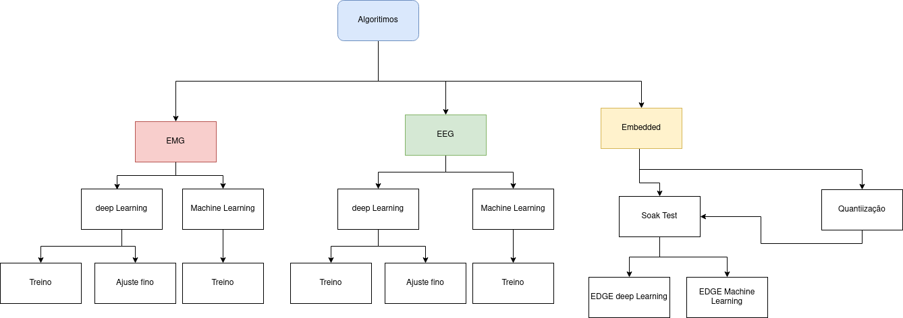

# IA Algoritmhs for BIO-SIGNALS

This repository contains **algorithms** and **pipelines** derived from cutting-edge research, focused on the development of advanced solutions and methods for identifying Steady state visually **Steady State Visually Evoked Potential (SSVEP)** commands from **Electroencephalography (EEG)** and gesture **Electromyography (EMG)** signals. The algorithms embedded in this project employ **machine learning** techniques and **deep artificial neural networks** for pattern recognition, enabling the identification of patterns through Artificial Intelligence (AI) algorithms. **This work aims to make a significant contribution to the field by exploring innovative approaches within AI to enhance accuracy and effectiveness in interpreting neural signals**.

## Table of Contents

- [Installation](#1)

    - [Windows](#1-1)
    - [Linux](#1-2)

- [Folder Structure and Main Files](#2)
- [How to Use](#3)
- [Notes](#4)
- [Disclaimer and Licensing Information](#5)

<a name="1"></a>

## Installation

<a name="1-2"></a>

### Windows
* Python Version : >=3.10

* Clone the repository
```
git clone git@bitbucket.org:eldoradocorp/fx_bios_ia.git
```

* Move to the project folder  
```
cd fx_bios_ia
```

* Create a python virtual enviroment on the root application folder  
```
python -m venv .venv
```

* Install dependencies
```  
venv\Scripts\pip.exe install -r requirements.txt
```

<a name="1-3"></a>

### Linux
* Python Version : >=3.10

* Clone repository
```
git clone git@bitbucket.org:eldoradocorp/fx_bios_ia.git
```

* Move to the project folder  
```
cd fx_bios_ia
```

* Create a python virtual enviroment on the root application folder  
```
python3 -m venv venv

```
* Activate the virtual environment:
```  
source venv/bin/activate
``` 

* Install Dependencies from requirements.txt:
```  
pip install -r requirements.txt
```  
<a name="2"></a>

## Folder Structure and Main Files

* **EMG/**: Contains the codes and pipelines of the project related to EMG.
* **EEG/** Contains the codes and pipelines of the project related to EEG.
* **embedded/** Contains the codes and Configurations to execute the trained models in embedded eviroment.

``` 
/root/data/data 
/IA Algoritmhs 
|-- /EMG
|   |-- /Dataloader
|   |-- /Experiments
|   |-- /Keras_deep_models
|   |-- /Processing
|   |-- /Utils
|-- /EEG
|   |-- /Dataloader
|   |-- /Experiments
|   |-- /Keras_deep_models
|   |-- /Processing
|   |-- /Utils
|-- /embedded
|   |-- /EEG/Experiments
|   |-- /EMG/Experiments	
|   |-- /Processing	
|   |-- /Quantization
```  

- The /root/data/data folder contains the HD-EMG and EEG-SSVEP databases that are used by the pipelines.
- The experiments folder contains the Jupyter notebooks that can be used to train and evaluate the models.
- The keras_deep_models folder contains the Keras deep learning models that are used by the pipelines.
- The processing folder contains the functions that are used to load and process the data.
- The utils folder contains the utility functions that are used by the other folders.



<a name="3"></a>

## How to Use

- The model training pipelines are in **".ipynb"** format and can be executed using **Jupyter Notebook**.
The training pipelines for EMG and EEG paradigms are inside the **EXPERIMENTS** folder, where there are two subfolders named **'Deep-learning'** and **'Machine-learning'**. Within these folders, there is a **'Train'** subfolder where the model training pipeline is located. In addition to the training folder, for deep-learning models, there is also a **fine-tuning** folder to train a specific model for user data.

- In the 'embedded' folder, there are functions used for model quantization, present in **'Quantization'**, and experiments using trained and quantized models are present in **EEG/Experiments** and **EMG/Experiments**.

<a name="4"></a>

## Notes

- All training files have been tested and validated within the **High Performance Computing (HPC)**, EDGE-IA codes for the embedded system have been applied to an EDGE device for validation in this eviroment.

- The pipelines use public HD-EMG and EEG-SSVEP signal databases available in the **"/root/data/data/"** folder of the HPC and are therefore not present in this repository, but they can be accessed through this path with the HPC.

<a name="5"></a>

## Disclaimer and Licensing Information:

The public databases of HD-EMG and EEG utilized in this research come with licenses permitting their use for the development of this study, as well as for the algorithms and solutions developed. Below are the links for access to each utilized database:

- **HD-EMG:**
   - A database of high-density surface electromyogram signals comprising 65 hand gestures performed in an isometric manner (65HDEMG): [Database1 Link](https://springernature.figshare.com/collections/A_database_of_high-density_surface_electromyogram_signals_comprising_65_hand_gestures_performed_in_an_isometric_manner/5090861)
   
   - Open Access Dataset and Toolbox of High-Density Surface Electromyogram Recordings (HYSER): [Database2 Link](https://www.physionet.org/content/hd-semg/1.0.0/)

- **EEG:**
    - EEG dataset and OpenBMI toolbox for three BCI paradigms: an investigation into BCI illiteracy (lee2019_ssvep): [Database3 Link](https://academic.oup.com/gigascience/article/8/5/giz002/5304369?login=false)

Please note that the usage of these databases is subject to the terms and conditions specified by the respective database providers. It is the responsibility of the users to comply with these licenses and regulations when utilizing the mentioned databases, algorithms, and solutions.
